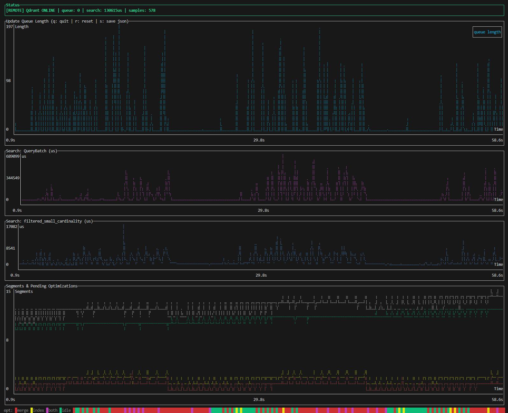

# Qdrant Telemetry Monitor

Real-time TUI dashboard for monitoring Qdrant telemetry. Polls the Qdrant telemetry endpoint every 500ms and displays live-updating charts.



## Usage

```bash
cargo run
```

By default the tool connects to `http://localhost:6333/telemetry?details_level=100`.

### CLI Flags

| Flag | Description |
|---|---|
| `--skip-access` | Ignore `access.json` and use the default localhost URL |
| `--queue` | Show the update queue length plot |
| `--search` | Show the search latency plot |
| `--points` | Show the segment points (plain vs indexed) plot |
| `--segments` | Show the segments count plot |

When no plot flags are specified, `--queue`, `--search`, and `--segments` are enabled by default. The `--points` plot is off by default.

To show only specific plots:

```bash
cargo run -- --queue --segments
```

To show all plots including points:

```bash
cargo run -- --queue --search --points --segments
```

## Remote Access (`access.json`)

To monitor a remote Qdrant instance, create an `access.json` file in the working directory:

```json
{
  "url": "https://your-qdrant-instance.example.com:6333",
  "api_key": "your-api-key-here"
}
```

The tool will automatically append `/telemetry?details_level=100` to the URL. The status bar shows `[REMOTE]` or `[LOCAL]` to indicate which mode is active.

If no `access.json` is found (or `--skip-access` is used), the tool falls back to localhost.

## Keyboard Controls

| Key | Action |
|---|---|
| `q` / `Esc` | Quit |
| `r` | Reset all data and start fresh |
| `s` | Save the last received telemetry JSON to a timestamped file (e.g. `telemetry_20260210_220852.json`) |
| `d` | Drop the first half of all collected data (useful to free memory on long runs) |

## Plots

### Status Bar

The top row shows the connection status and current values:

- **Waiting for Qdrant process...** (yellow) — no successful response yet
- **Qdrant ONLINE** (green) — connected; shows current queue length, search latency, and sample count
- **Qdrant process OFFLINE** (red) — was connected but lost connection; waiting for reconnect

Recording starts automatically once the update queue length becomes non-zero.

### Update Queue Length

Tracks the number of pending updates in Qdrant's internal update queue over time. A rising queue indicates that writes are arriving faster than Qdrant can process them. When the queue drops back to zero, all updates have been applied.

- **Color:** Cyan

### Search Latency

Split into two stacked sub-charts with independent Y-axis scales:

- **QueryBatch** (top, magenta) — average duration in microseconds of gRPC `/qdrant.Points/QueryBatch` requests
- **filtered_small_cardinality** (bottom, blue) — sum of `filtered_small_cardinality.avg_duration_micros` across all segments, showing per-segment filtered search cost

### Segment Points (plain vs indexed)

Shows the total number of points split by segment type:

- **plain** (yellow) — points in plain (non-indexed) segments
- **indexed** (green) — points in segments with built indexes

During indexing, you'll see points move from plain to indexed as segments get optimized.

### Segments & Pending Optimizations

Tracks segment counts and optimization activity:

- **total** (white) — total number of segments
- **plain** (yellow) — segments with plain index
- **non-plain** (green) — segments with built indexes
- **pending-opt** (red) — optimization log entries that are not in "done" status

Below the chart is a **color-coded optimization status bar** showing what type of optimization is running at each point in time:

| Color | Meaning |
|---|---|
| Green | Idle (no active optimization) |
| Red | Merge optimization running |
| Yellow | Indexing optimization running |
| Magenta | Both merge and indexing running simultaneously |
